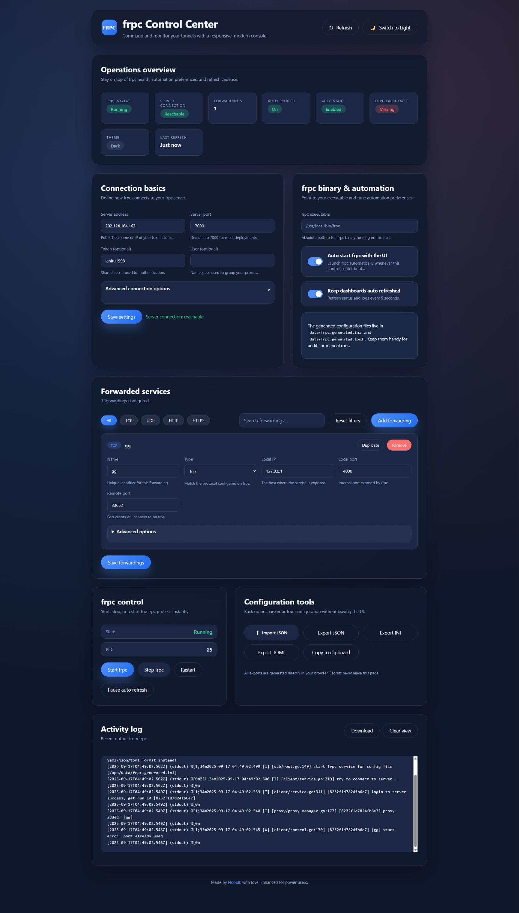
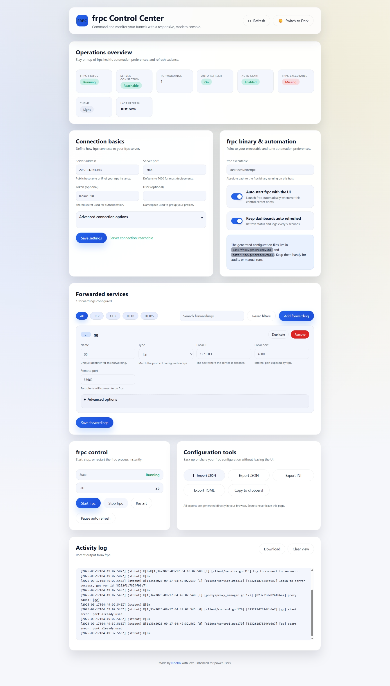

# frpc UI

Run and monitor your [`frpc`](https://github.com/fatedier/frp) client from a clean dashboard. Quickly draft tunnels, persist them to disk, and manage the underlying process without leaving the browser.

**Highlights**
- Live reachability status while you edit common FRP settings
- Auto-start/stop controls with dedicated save actions for global settings and forwarding rules
- Works with Docker out of the box, or alongside your existing local `frpc` binary
- Persists configuration to disk so upgrades never wipe your tunnels

## UI Showcase




## Quick Start

### Run locally

```bash
npm install
npm start
```

The UI will be available at http://localhost:4000.

### Run with Docker Compose

```bash
docker compose up --build -d
```

The bundled `docker-compose.yml` launches two services:

- `frpc`: FRP client based on `${FRPC_IMAGE:-snowdreamtech/frpc:alpine}`
- `frpc-ui`: this dashboard, exposed on port 4000

> **Heads-up**: `frpc` defaults to `network_mode: host`. Host networking requires a Linux engine. On macOS/Windows the UI still works, but `frpc` cannot expose remote ports unless you run under WSL or a Linux VM.

### Deploy using the prebuilt image

Use `docker-compose.live.yml` when you just want to pull published images:

```bash
docker compose -f docker-compose.live.yml pull
docker compose -f docker-compose.live.yml up -d
```

Visit `http://<server-ip>:4000` and configure your tunnels.

## Configuration & Data

All persistent files live inside `./data` by default:

- `config.json`: everything saved via the UI
- `frpc.generated.toml` / `frpc.generated.ini`: regenerated client config consumed by the FRPC container

Bring the stack down or tail logs at any time:

```bash
docker compose logs -f
docker compose down
```

(For the live deployment file, pass `-f docker-compose.live.yml` as shown above.)

## Development Notes

- HTTP API routes live under `/api/*`; static assets are served from `public/`
- The backend keeps the latest 500 log lines available to the UI
- Delete `data/config.json` to reset the app to a clean slate

## Contributing

Contributions are very welcome! Here is how to get started:

1. Fork the repo and create a feature branch
2. Follow the local quick start above (or run the Docker stack) to verify your changes
3. Add or update tests/docs whenever behavior changes
4. Open a pull request describing the problem and how your change addresses it

If you discover a bug or have an idea, please [open an issue](../../issues) or start a discussion. Feedback and feature proposals make the project better for everyone.

## Roadmap Ideas

- [ ] Expanded support for advanced FRP directives
- [ ] Role-based access or authentication for shared dashboards
- [ ] Built-in health checks and alerting
- [ ] Additional theme options and layout tweaks
